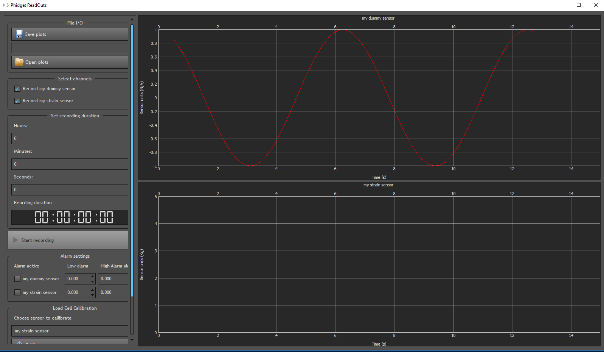

Example Program
******************

In this section we will walk through an example program which connects to both a
real Phidget sensor and a simulated dummy sensor.

Imports and file location
===========================

Any Python script which wishes to utilize classes belonging the Phidget data logger
package must be able to import them. To do this most easily it is best to place the script
in a directory which contains both the script and the Phidget data logger project folder.
If this is the case then we can import all the classes from the Phidget data logger
application as follows:

.. code-block:: python

  import PhidgetDataLogger as PDL

Creating the sensor objects
==============================

With the module now imported we can begin to construct the sensor objects we want
to monitor in the application. To start with we will construct a :py:mod:`DummySensor`.
This module is designed to simulate a Phidget device by spitting out data for a Sin wave
with a chosen frequency. To create a :py:mod:`DummySensor` we need to give as arguments
two values. The first is the frequency of the sin wave which we want the sensor to
generate and the second is refresh period. The refresh period is the period of time
we want our data to be stored and plotted for before the graphs will refresh and clear
the data. With these values we can create a dummy sensor as follows:

.. code-block:: Python

  S1 = PDL.DummySensor(1,15)

Here we have opted for a frequency of 1 and a refresh period of 15 seconds.

Next we will create a :py:mod:`StrainSensor` type object. This will serve two functions.
Firstly it will allow us to see how to instance objects which connect to actual
Phidget devices and secondly it will give us access to the calibration functionality
provided by :py:mod:`StrainCalibrator` which is only available for objects of type
:py:mod:`StrainSensor`. To create a :py:mod:`StrainSensor` type object we are required
to pass it four pieces of information. First is the device serial number. This is
the unique ID of the Phidget device which acts as an intermediary between the load cell
and the computer it is connected to. In most cases this device can connect to several
load cells simultaneously so the second argument indicates the channel on the device
which we would like to connect to. Thirdly we will pass the data interval, this is the
time in milliseconds between successive sensor readings. **The data interval should only be
set to a multiple of 8 milliseconds as the USB only polls the sensor every 8 milliseocnds**.
Finally as with all sensor objects we pass the refresh period and optionally a human
readable label which we will use to tell the different sensors apart. Combining all
of this we can instantiate the object as shown:

.. code-block:: python

  S2 = PDL.StrainSensor(46715,1,64,15,"my strain sensor")

The Phidget display application
================================

With our sensors objects created we are now ready to define the :py:mod:`PhidgetDisplayApp`
object. This object is responsible for generating the main UI for live plotting of sensor
data amongst other things. In order to instantiate the object we are required to provide
only one argument which is a list of sensors which we would like to monitor. However
we can also chose to provide the y axis limits for the graphs displaying each sensors
data. This can be a good idea when we know before hand the likely range of values
our sensors will encounter during an experiment. In this case our :py:mod:`DummySensor`
will output a Sin wave which will have y values between -1 and 1. Our :py:mod:`StrainSensor`
on the other hand will likely be outputting positive values between 0 and the maximum
capacity of the sensor which in this case will be 5Kg. We can define the lists containing
our sensors and y data ranges as follows:

.. code-block:: python

  sensorList = [S1,S2]
  yDataRanges = [ [-1,1] , [0,5] ]

With the sensor list and data ranges now defined we can easily create the main
application and run it as follows:

.. code-block:: python

  myApp = PDL.PhidgetDisplayApp(sensorList,yDataRanges=yDataRanges)
  myApp.run()

If everything has gone to plan you should now be greeted with the main application
window showing live traces of both your dummy and strain sensors.

The full code for this section is shown below for completeness:

.. code-block:: python

  if __name__ == "__main__":
    import PhidgetDataLogger as PDL
    S1 = PDL.DummySensor(1,15, "my dummy sensor")
    S2 = PDL.StrainSensor(467715,1,64,15,"my strain sensor")

    sensorList = [S1,S2]
    yDataRanges = [ [-1,1] , [0,5] ]

    myApp = PDL.PhidgetDisplayApp(sensorList,yDataRanges=yDataRanges)
    myApp.run()
